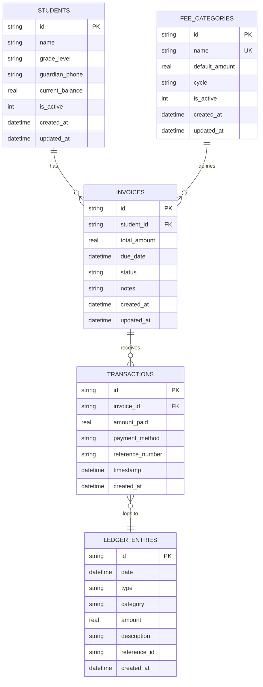

# Phase 1: Desktop-Optimized Local Database Schema & Dart Models

## Overview
This document outlines the Phase 1 foundation for the **School Management System (SMS)** Admin and Accounting Module targeting **Windows Desktop** using Flutter and SQLite (`sqflite_common_ffi`).

---

## 1. Tech Stack Selection & Justification

| Layer | Technology | Rationale |
| :--- | :--- | :--- |
| **UI Framework** | Flutter Desktop (Windows) | High performance, native Windows execution, customized keyboard shortcuts, and flexible layout for wide screens. |
| **Local Storage** | SQLite (`sqflite_common_ffi`) | Native C FFI bindings providing zero-latency local database operations on Windows Desktop, WAL journal mode support, and full relational integrity. |
| **State Management** | **Flutter Riverpod** (`flutter_riverpod`) | Compile-safe state management, testable providers, automatic reactivity, and decoupling of business logic from UI widgets. |

---

## 2. Database Design & Entity Architecture

The local database schema consists of **5 core financial tables**, **10 performance indexes**, and **2 database triggers** for automatic ledger and balance calculation.



---

## 3. Core Database Schema & DDL Scripts

### DDL Implementation File
Located at: [`schema.sql`](file:///home/whoisadheep/Documents/School%20Management%20System/docs/schema.sql)

```sql
PRAGMA foreign_keys = ON;
PRAGMA journal_mode = WAL;

-- Students
CREATE TABLE IF NOT EXISTS students (
    id              TEXT PRIMARY KEY,
    name            TEXT NOT NULL,
    grade_level     TEXT NOT NULL,
    guardian_phone  TEXT,
    current_balance REAL NOT NULL DEFAULT 0.0,
    is_active       INTEGER NOT NULL DEFAULT 1,
    created_at      TEXT NOT NULL DEFAULT (datetime('now')),
    updated_at      TEXT NOT NULL DEFAULT (datetime('now'))
);

-- Fee Categories
CREATE TABLE IF NOT EXISTS fee_categories (
    id              TEXT PRIMARY KEY,
    name            TEXT NOT NULL UNIQUE,
    default_amount  REAL NOT NULL,
    cycle           TEXT NOT NULL CHECK (cycle IN ('monthly', 'yearly')),
    is_active       INTEGER NOT NULL DEFAULT 1,
    created_at      TEXT NOT NULL DEFAULT (datetime('now')),
    updated_at      TEXT NOT NULL DEFAULT (datetime('now'))
);

-- Invoices
CREATE TABLE IF NOT EXISTS invoices (
    id              TEXT PRIMARY KEY,
    student_id      TEXT NOT NULL,
    total_amount    REAL NOT NULL,
    due_date        TEXT NOT NULL,
    status          TEXT NOT NULL DEFAULT 'pending'
                    CHECK (status IN ('pending', 'paid', 'overdue', 'partial', 'cancelled')),
    notes           TEXT,
    created_at      TEXT NOT NULL DEFAULT (datetime('now')),
    updated_at      TEXT NOT NULL DEFAULT (datetime('now')),
    FOREIGN KEY (student_id) REFERENCES students (id)
        ON DELETE RESTRICT ON UPDATE CASCADE
);

-- Transactions
CREATE TABLE IF NOT EXISTS transactions (
    id              TEXT PRIMARY KEY,
    invoice_id      TEXT NOT NULL,
    amount_paid     REAL NOT NULL,
    payment_method  TEXT NOT NULL
                    CHECK (payment_method IN ('cash', 'bank_transfer', 'cheque', 'online', 'other')),
    reference_number TEXT,
    timestamp       TEXT NOT NULL DEFAULT (datetime('now')),
    created_at      TEXT NOT NULL DEFAULT (datetime('now')),
    FOREIGN KEY (invoice_id) REFERENCES invoices (id)
        ON DELETE RESTRICT ON UPDATE CASCADE
);

-- Ledger Entries
CREATE TABLE IF NOT EXISTS ledger_entries (
    id              TEXT PRIMARY KEY,
    date            TEXT NOT NULL,
    type            TEXT NOT NULL CHECK (type IN ('income', 'expense')),
    category        TEXT NOT NULL,
    amount          REAL NOT NULL,
    description     TEXT,
    reference_id    TEXT,
    created_at      TEXT NOT NULL DEFAULT (datetime('now'))
);

-- Database Triggers for Automatic Balance & Status Calculations
CREATE TRIGGER IF NOT EXISTS trg_update_balance_after_transaction
AFTER INSERT ON transactions
BEGIN
    UPDATE students
    SET current_balance = current_balance - NEW.amount_paid,
        updated_at = datetime('now')
    WHERE id = (SELECT student_id FROM invoices WHERE id = NEW.invoice_id);

    UPDATE invoices
    SET status = CASE
        WHEN (SELECT COALESCE(SUM(amount_paid), 0) FROM transactions WHERE invoice_id = NEW.invoice_id) >= total_amount THEN 'paid'
        WHEN (SELECT COALESCE(SUM(amount_paid), 0) FROM transactions WHERE invoice_id = NEW.invoice_id) > 0 THEN 'partial'
        ELSE status
    END,
    updated_at = datetime('now')
    WHERE id = NEW.invoice_id;
END;

CREATE TRIGGER IF NOT EXISTS trg_update_balance_after_invoice
AFTER INSERT ON invoices
BEGIN
    UPDATE students
    SET current_balance = current_balance + NEW.total_amount,
        updated_at = datetime('now')
    WHERE id = NEW.student_id;
END;
```

---

## 4. Source Files Directory Structure

All files are organized within the project folder (`/home/whoisadheep/Documents/School Management System`):

```
School Management System/
├── analysis_options.yaml
├── docs/
│   ├── phase_1_summary.md
│   └── schema.sql
├── lib/
│   ├── app.dart
│   ├── main.dart
│   ├── core/
│   │   ├── constants/
│   │   │   └── app_constants.dart
│   │   ├── database/
│   │   │   └── database_helper.dart
│   │   └── theme/
│   │       └── app_theme.dart
│   └── models/
│       ├── fee_category.dart
│       ├── invoice.dart
│       ├── ledger_entry.dart
│       ├── models.dart
│       ├── student.dart
│       └── transaction.dart
└── pubspec.yaml
```
