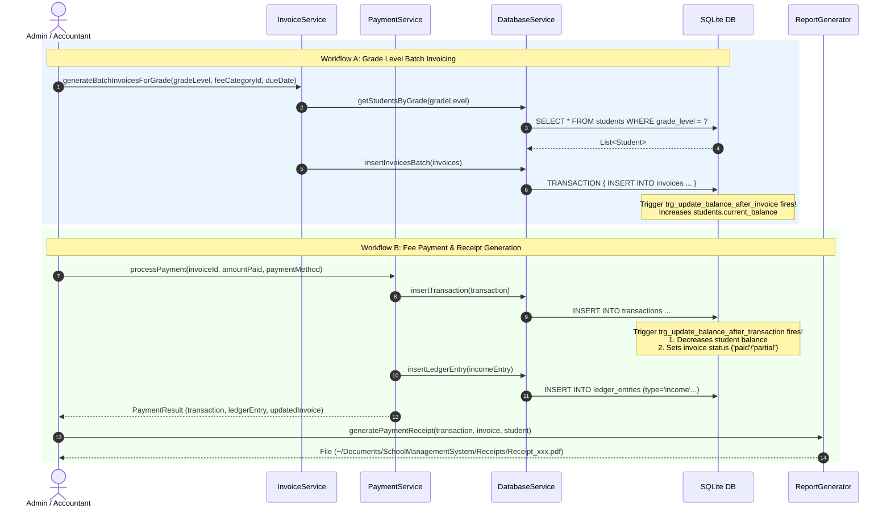

# Phase 2: Core Desktop Services (Dart)

## Overview
This document outlines Phase 2 of the **School Management System (SMS)** Admin and Accounting Module. In this phase, core Dart local services handling business logic, database transactions, batch billing, payment clearing, and A4 PDF receipt generation were implemented.

---

## 1. Implemented Services Summary

| Service | File | Core Responsibilities |
| :--- | :--- | :--- |
| **`DatabaseService`** | [`database_service.dart`](file:///home/whoisadheep/Documents/School%20Management%20System/lib/services/database_service.dart) | High-performance CRUD for Students, Fee Categories, Invoices, Transactions, and Ledger Entries. Supports raw SQL, batch transactions, and aggregation queries. |
| **`InvoiceService`** | [`invoice_service.dart`](file:///home/whoisadheep/Documents/School%20Management%20System/lib/services/invoice_service.dart) | Batch-generates monthly or annual invoices for all active students in a specific grade level inside a single atomic SQLite transaction. |
| **`PaymentService`** | [`payment_service.dart`](file:///home/whoisadheep/Documents/School%20Management%20System/lib/services/payment_service.dart) | Records payment transactions, triggers automatic balance and invoice status calculations (`paid`/`partial`), and logs an `income` entry in `ledger_entries`. |
| **`ReportGenerator`** | [`report_generator.dart`](file:///home/whoisadheep/Documents/School%20Management%20System/lib/services/report_generator.dart) | Generates A4-sized PDF receipts using the `pdf` package with school branding, student details, line items, and saves directly to the Documents folder (`SchoolManagementSystem/Receipts`). |

---

## 2. Business Workflows & Data Flow



---

## 3. Directory Layout

```
School Management System/
├── docs/
│   ├── phase_1_summary.md
│   ├── phase_2_summary.md
│   └── schema.sql
├── lib/
│   ├── app.dart
│   ├── main.dart
│   ├── core/
│   │   ├── constants/app_constants.dart
│   │   ├── database/database_helper.dart
│   │   └── theme/app_theme.dart
│   ├── models/
│   │   ├── fee_category.dart
│   │   ├── invoice.dart
│   │   ├── ledger_entry.dart
│   │   ├── models.dart
│   │   ├── student.dart
│   │   └── transaction.dart
│   └── services/
│       ├── database_service.dart
│       ├── invoice_service.dart
│       ├── payment_service.dart
│       ├── payment_service.dart
│       ├── report_generator.dart
│       └── services.dart
└── pubspec.yaml
```
