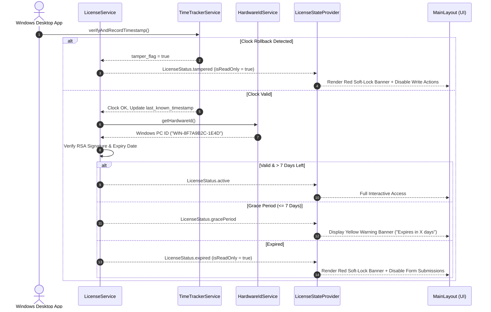

# Phase 5: Offline RSA Licensing & Anti-Tamper Module

## Overview
Phase 5 implements a 100% offline, cryptographically secure RSA licensing and anti-tamper security module for the **School Management System (SMS)** Windows Desktop application.

---

## 1. Security Architecture & Principles

| Feature | Implementation | Description |
| :--- | :--- | :--- |
| **No Cloud Dependency** | 100% Offline | The application makes zero network requests. All verification is cryptographic and local. |
| **RSA Asymmetric Standard** | 2048-bit Public Key | Hardcoded Public Key in app for offline verification. Private Key is kept strictly by the vendor (`Sai Infotek`). |
| **Hardware Locking** | Unique Machine ID | Uses `device_info_plus` to extract/generate Windows Device ID (`WIN-xxx`), locking each license to a single PC. |
| **Anti-Time-Travel** | High-Water Mark | `TimeTrackerService` verifies system clock on startup. If `DateTime.now()` is older than `last_known_timestamp`, `tamper_flag = true` is set. |
| **Soft-Lock (Read-Only)** | Reactive Riverpod Provider | If expired or tampered, all `INSERT`/`UPDATE`/`DELETE` buttons are disabled. Read access (dashboard, search, print receipts) remains functional. |
| **Grace Period Warning** | Yellow Top Banner | Displays a persistent top banner starting 7 days prior to license expiration. |

---

## 2. Component Diagram & Verification Lifecycle



---

## 3. License Payload Schema

```json
{
  "hardware_id": "WIN-8F7A9B2C-1E4D",
  "expiry_date": "2027-08-05T00:00:00.000Z",
  "client_name": "Mother's Kids Play School",
  "issued_at": "2026-08-05T00:00:00.000Z"
}
```

---

## 4. Implemented Source Files

1. **Hardware ID Extractor**: [`hardware_id_service.dart`](file:///home/whoisadheep/Documents/School%20Management%20System/lib/services/hardware_id_service.dart)
2. **Anti-Time-Travel Utility**: [`time_tracker_service.dart`](file:///home/whoisadheep/Documents/School%20Management%20System/lib/services/time_tracker_service.dart)
3. **RSA License Validator**: [`license_service.dart`](file:///home/whoisadheep/Documents/School%20Management%20System/lib/services/license_service.dart)
4. **Offline Key Generator**: [`license_generator.dart`](file:///home/whoisadheep/Documents/School%20Management%20System/lib/services/license_generator.dart)
5. **Reactive License Provider**: [`license_provider.dart`](file:///home/whoisadheep/Documents/School%20Management%20System/lib/providers/license_provider.dart)
6. **Activation UI Screen**: [`license_activation_view.dart`](file:///home/whoisadheep/Documents/School%20Management%20System/lib/ui/views/license/license_activation_view.dart)
7. **Main UI Integration**: [`main_layout.dart`](file:///home/whoisadheep/Documents/School%20Management%20System/lib/ui/layout/main_layout.dart)
